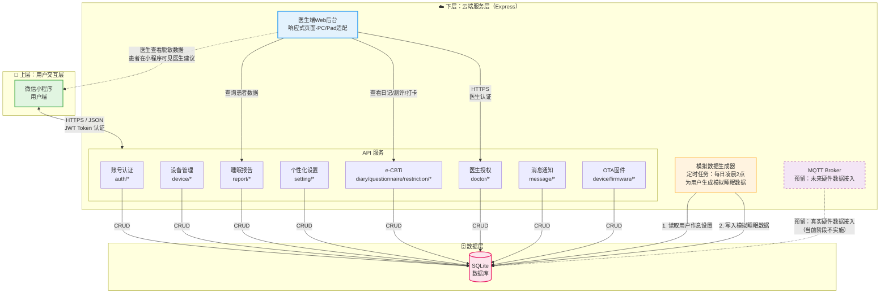
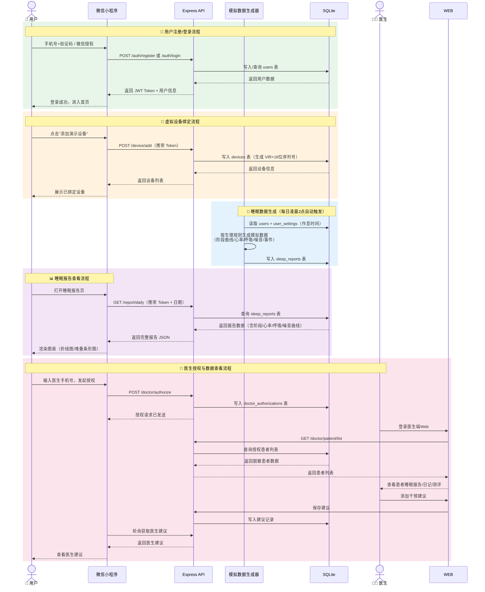

# 系统架构图

> 依据《智能睡眠环境调控设备 - 软件系统功能需求（实训需求）V1.0》中的总体架构描述绘制。

## 系统总体架构



## 数据流向说明



## 核心数据表关系

```mermaid
erDiagram
    users ||--o{ devices : "绑定"
    users ||--o{ sleep_reports : "拥有"
    users ||--o{ sleep_diary : "记录"
    users ||--o{ questionnaire_results : "测评"
    users ||--o{ sleep_restriction_log : "打卡"
    users ||--o{ doctor_authorizations : "授权(患者)"
    users ||--o{ doctor_authorizations : "授权(医生)"
    users ||--|| user_settings : "配置"
    devices ||--o{ sleep_reports : "产生"

    users {
        bigint user_id PK
        varchar phone UK
        varchar nickname
        varchar avatar_url
        tinyint gender
        int birth_year
        tinyint role
        tinyint status
        datetime created_at
    }

    devices {
        varchar device_id PK
        bigint user_id FK
        varchar device_name
        tinyint is_virtual
        varchar firmware_version
        datetime last_active_time
        datetime created_at
    }

    sleep_reports {
        bigint report_id PK
        bigint user_id FK
        varchar device_id FK
        date report_date
        int sleep_score
        int total_minutes
        int deep_minutes
        int rem_minutes
        int light_minutes
        int wake_minutes
        decimal avg_heart_rate
        text events_json
        text heart_rate_curve
        text respiration_curve
        text stage_curve
        text noise_curve
        datetime created_at
    }

    user_settings {
        bigint user_id PK_FK
        time bedtime
        time wakeup_time
        int sunrise_duration
        varchar sound_preference
        varchar wake_sound
        int preferred_brightness
        int preferred_volume
        varchar device_timezone
        boolean do_not_disturb_enabled
        time dnd_start
        time dnd_end
    }

    doctor_authorizations {
        bigint id PK
        bigint patient_user_id FK
        bigint doctor_user_id FK
        enum status
        datetime expire_at
        datetime created_at
    }
```

## 技术栈说明

| 层级 | 技术选型 | 说明 |
|------|---------|------|
| 微信小程序 | 原生框架 / UniApp | 用户端交互界面 |
| 云后台 API | **Express (Node.js)** | RESTful API，JWT 认证，统一 `{code, message, data}` 响应格式 |
| 数据库 | **SQLite** | 轻量级嵌入式数据库，实训阶段免安装配置 |
| 医生端 Web | 响应式 HTML/CSS/JS | PC/Pad 适配，独立于小程序的后台页面 |
| 模拟数据生成器 | Node.js 定时任务 (node-cron) | 每日凌晨2点触发，按生理规则生成数据 |
| 未来扩展 | MQTT Broker | 预留真实硬件数据接入通道 |

---

*注：当前实训阶段不依赖真实硬件，所有设备数据、环境调控指令均使用模拟数据或预留接口。硬件就绪后，仅需替换数据源和控制指令下发模块即可无缝接入。*
